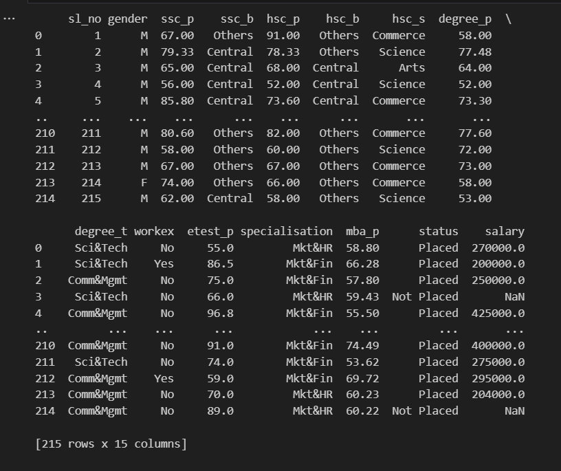
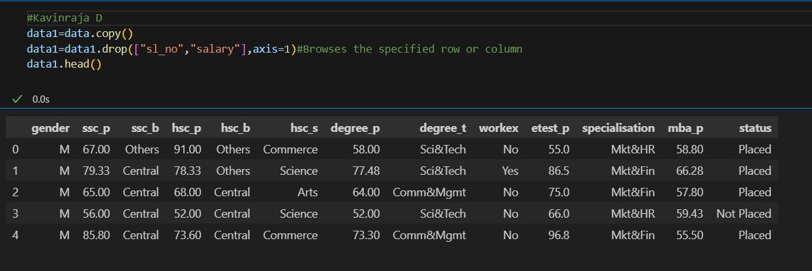
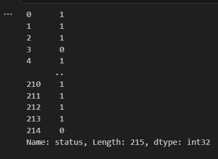
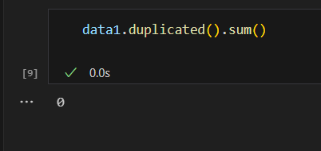
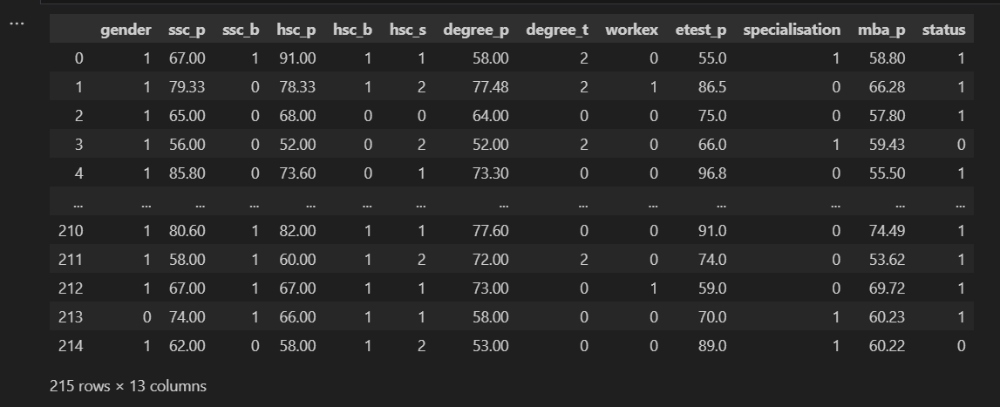
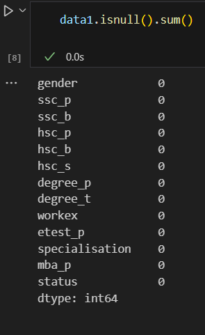
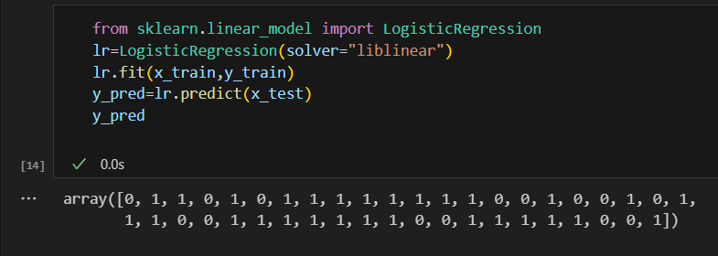
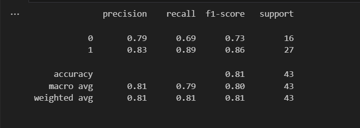
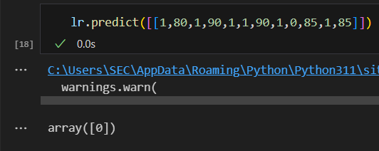

# Implementation-of-Logistic-Regression-Model-to-Predict-the-Placement-Status-of-Student

## AIM:
To write a program to implement the the Logistic Regression Model to Predict the Placement Status of Student.

## Equipments Required:
1. Hardware – PCs
2. Anaconda – Python 3.7 Installation / Jupyter notebook

## Algorithm
1. Import the required packages and print the present data.
2. Print the placement data and salary data.
3. Find the null and duplicate values.
4. Using logistic regression find the predicted values of accuracy , confusion matrices.
5. Display the results.


## Program:
```python
/*
Program to implement the the Logistic Regression Model to Predict the Placement Status of Student.
Developed by: Ganesh R
RegisterNumber:  212222240029
*/

import pandas as pd
data=pd.read_csv("Placement_Data.csv")
data.head()

data1=data.copy()
data1=data1.drop(["sl_no","salary"],axis=1)#Browses the specified row or column
data1.head()

data1.isnull().sum()

data1.duplicated().sum()

from sklearn.preprocessing import LabelEncoder
le=LabelEncoder()
data1["gender"]=le.fit_transform(data1["gender"])
data1["ssc_b"]=le.fit_transform(data1["ssc_b"])
data1["hsc_b"]=le.fit_transform(data1["hsc_b"])
data1["hsc_s"]=le.fit_transform(data1["hsc_s"])
data1["degree_t"]=le.fit_transform(data1["degree_t"])
data1["workex"]=le.fit_transform(data1["workex"])
data1["specialisation"]=le.fit_transform(data1["specialisation"] )     
data1["status"]=le.fit_transform(data1["status"])       
data1 

x=data1.iloc[:,:-1]
x

y=data1["status"]
y

from sklearn.model_selection import train_test_split
x_train,x_test,y_train,y_test=train_test_split(x,y,test_size=0.2,random_state=0)

from sklearn.linear_model import LogisticRegression
lr=LogisticRegression(solver="liblinear")
lr.fit(x_train,y_train)
y_pred=lr.predict(x_test)
y_pred

from sklearn.metrics import accuracy_score
accuracy=accuracy_score(y_test,y_pred)
accuracy

from sklearn.metrics import confusion_matrix
confusion=confusion_matrix(y_test,y_pred)
confusion

from sklearn.metrics import classification_report
classification_report1 = classification_report(y_test,y_pred)
print(classification_report1)

lr.predict([[1,80,1,90,1,1,90,1,0,85,1,85]])


```

## Output:
## Placement Data:

## Salary Data:

## Checking the null() function:


## Data Duplicate:

## Print Data:

## Data-Status:

## Y_prediction array:

## Accuracy value:

## Confusion array:

## Classification Report:

## Prediction of LR:



## Result:
Thus the program to implement the the Logistic Regression Model to Predict the Placement Status of Student is written and verified using python programming.
